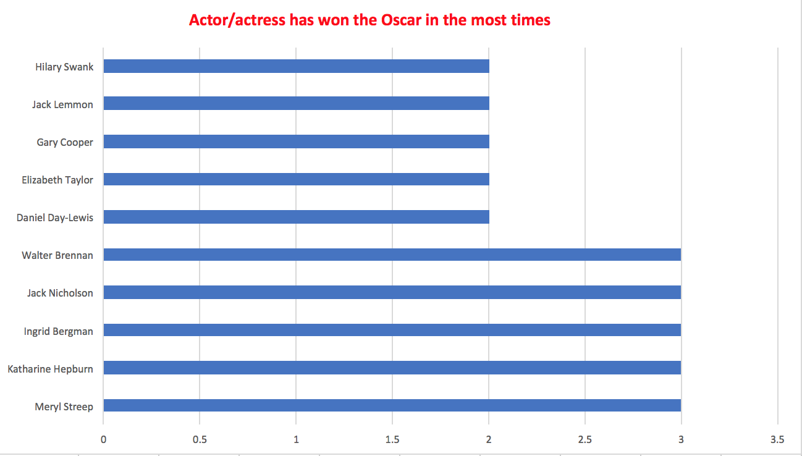
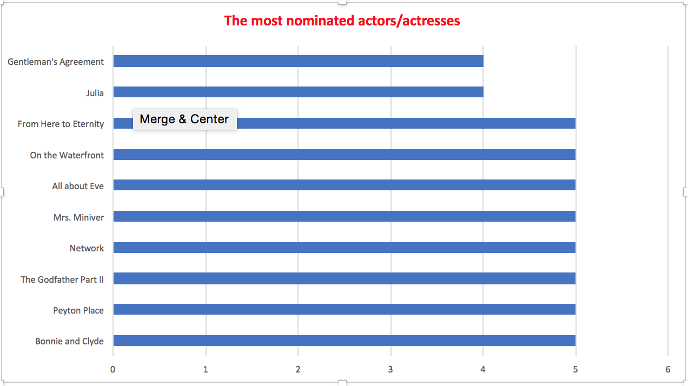
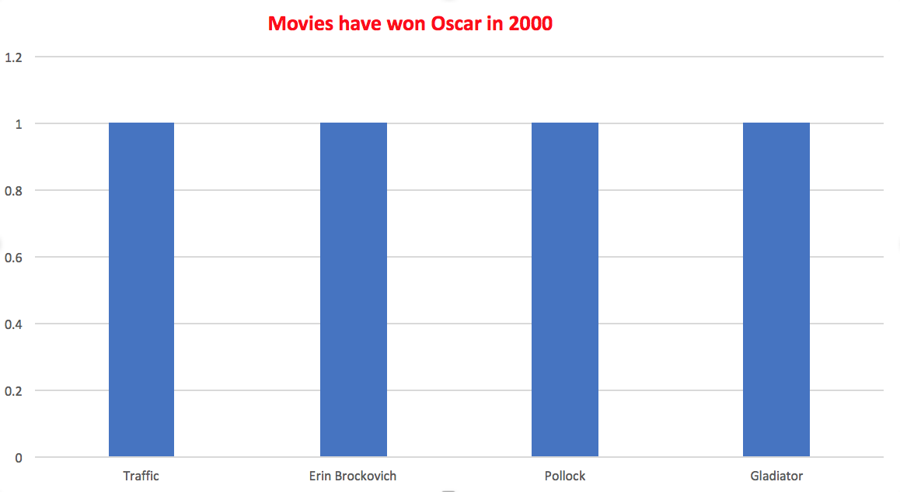
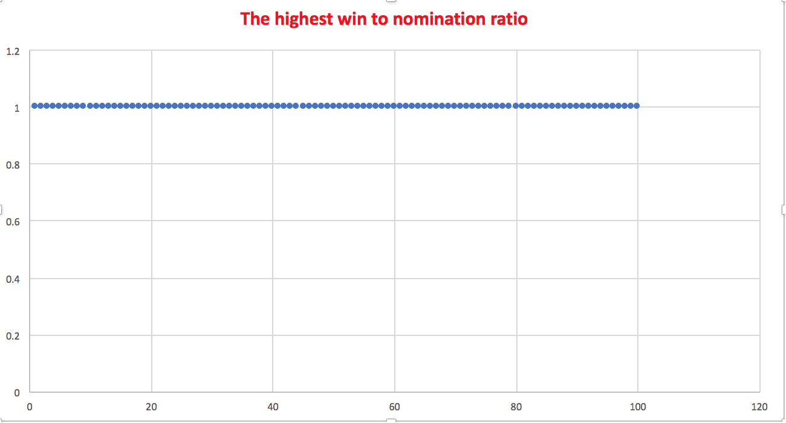

# ICA4-Siyu-Chen 

-- Which actor/actress has won the Oscar in the most times?

```SQL

SELECT

nominee,

count(winner) as count

from datasets.oscar_nominees

where winner ='true'

group by  nominee

order by count DESC

Limit 10

```





-- Which movies had the most nominated actors/actresses?

```SQL

SELECT

movie,

count(nominee)

from datasets.oscar_nominees

group by movie

order by count DESC

Limit 10

```





-- Which movie has won Oscar in 2000? 

```SQL

SELECT 

movie

From datasets.oscar_nominees

Where year=2000 and winner ='true'

```





-- Who has the highest win to nomination ratio?

```SQL

Select

nominee,

sum (case when winner = 'true' then 1 else 0 end)/count(nominee)::float as ratio

from datasets.oscar_nominees

group by nominee

order by ratio desc

Limit 100

```





-- How many actor/actress have been Oscar nominated?

```SQL

SELECT

nominee,

count(nominee)

from datasets.oscar_nominees

group by nominee

Limit 100

```


1[ICA4](ICA4-5.png)
